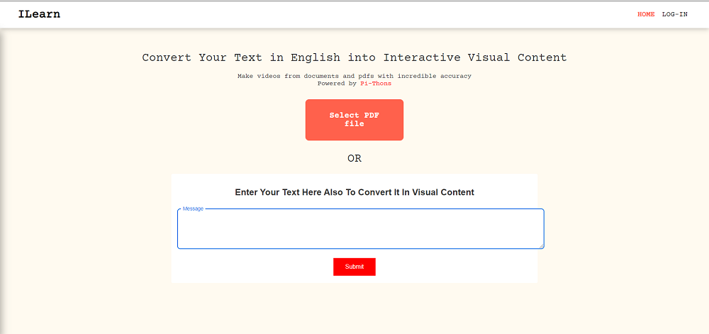

## TEAM Pi-thons

# 🎇ILearn
- A web app that converts textual content in English to visual content in any local language.
- User can eithier upload pdf or can give their desired text in the message box.
- User can also get to see a preview of the pdf or text input.
- There are a plethora of options for language which user wants to convert ie. Hindi, Marathi, Telegu, Tamil and may more and adjust speed as well.
- User can download the video and audio at a time or separately.
- User can also login and sign-up with desired credentials.

# 🎁Domain of Project 
- Education
- Social Good

# ⭐Technologies Used
* Frontend Technolgies Used:
    1. ReactJs
 * Backend Technolgies Used:
    1. Flask
    2. NLP Techniques
    3. Google Translate API
    4. GTTS
    5. Image Scrapping using Morzilla

## 🤝 HOW TO CONTRIBUTE?

- Find an Issue or Create your own Issues!
- Wait for the admin's approval comment on the issue 
- Fork the Repository and create a Branch for any Issue by following the branch creation rule.
- Work on the issue.
- Create a Pull Request (from your branch to the main repository master branch) which will be promptly reviewed and suggestions would be added to improve it.
- Add Screenshots to help us know what this issue is all about.
## Contributors ✨

Thanks goes to these wonderful people ([emoji key](https://allcontributors.org/docs/en/emoji-key)):

<!-- ALL-CONTRIBUTORS-LIST:START - Do not remove or modify this section -->
<!-- prettier-ignore-start -->
<!-- markdownlint-disable -->
<table>
  <tr>
    <td align="center"><a href="https://github.com/anshusandhi6"> <b>Anshuman Sandhibigraha</b></a> 💻</td>
    <td align="center"><a href="https://github.com/sameersahu473"> <b>Sameer Ranjan Sahu</b></a> 💻</td>
       <td align="center"><a href="https://github.com/IshaanDesai45"> <b>Ishaan Desai</b></a> 💻</td>
   
  </tr>
</table>

<!-- markdownlint-enable -->
<!-- prettier-ignore-end -->
<!-- ALL-CONTRIBUTORS-LIST:END -->

This project follows the [all-contributors](https://github.com/all-contributors/all-contributors) specification. Contributions of any kind welcome!
